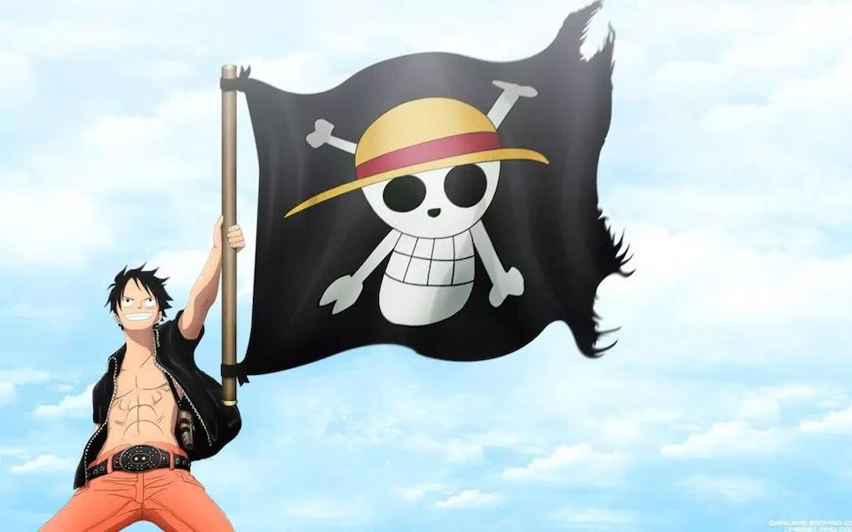
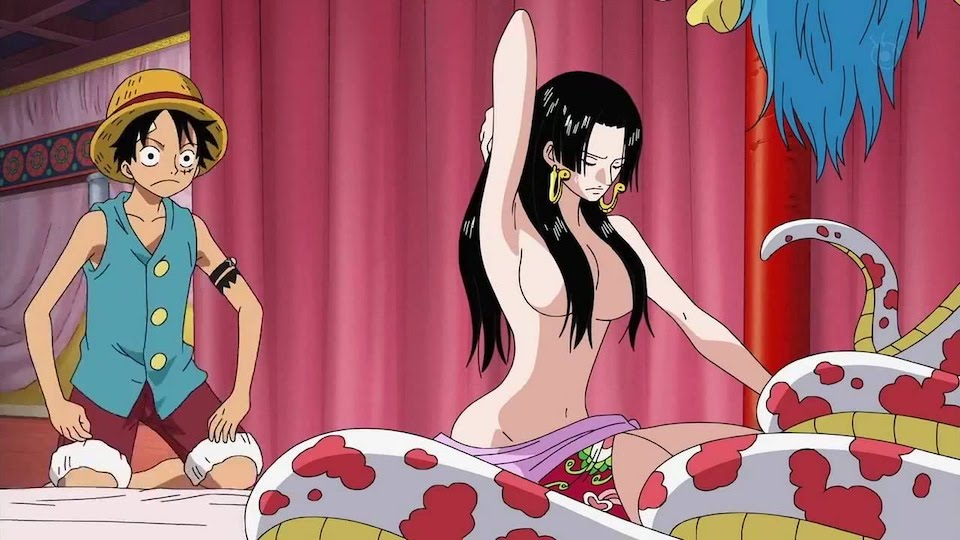
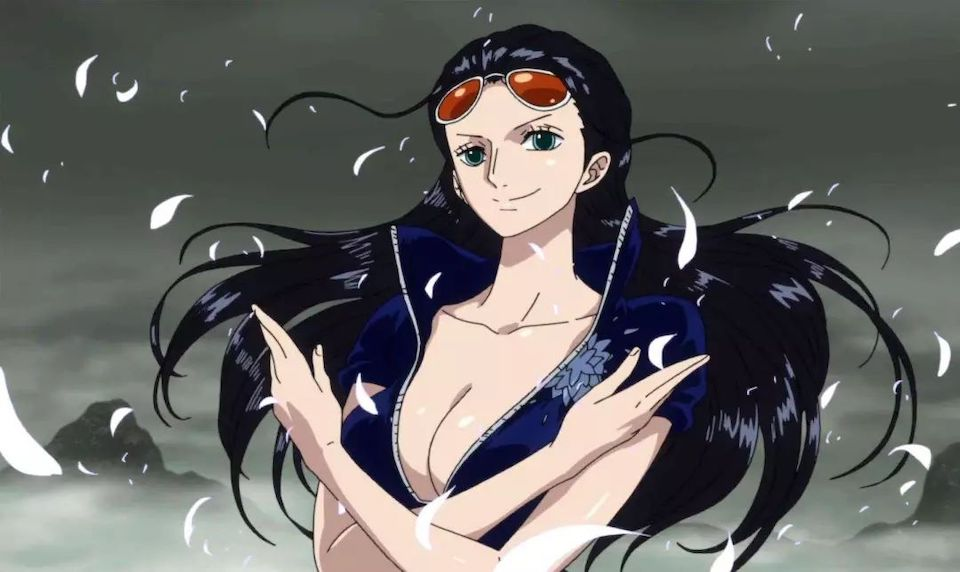

# Golang Advanced Snippets
Go Advanced Snippet during learning Go ...

## Reference
* [Golang Tutorial](https://tutorialedge.net/course/golang/)
* [Analyzing the performance of Go functions with benchmarks](https://medium.com/justforfunc/analyzing-the-performance-of-go-functions-with-benchmarks-60b8162e61c6)
* [Practical Go Benchmarks](https://stackimpact.com/blog/practical-golang-benchmarks/)
* [How to write benchmarks in Go](https://dave.cheney.net/2013/06/30/how-to-write-benchmarks-in-go)

## 番外

盘点《海贼王》中草帽小子身后的强大后宫团队。

喜欢看《海贼王》的小伙伴肯定都知道草帽小子路飞看似是一个只知道吃的大白痴，实则是一个大暖男吧！无论是走到哪里，路飞的人格魅力总是能吸引住异性的目光，进入别人的内心，从而俘虏了她的芳心！但是草帽小子从来就对异性不敏感，对于路飞来说成为海贼王和美食才是他毕生所要追求的！！！所以，路飞估计是一个恋爱绝缘体吧，即使有人明确的跟路飞表白，估计路飞也回问喜欢究竟是一个怎么样的美食。接下来我们盘点下在《海贼王》中，与路飞有道不清关系的几位重要人物吧！

### 第一位：九蛇海贼团 女帝 波雅·汉库克

波雅·汉库克是战斗民族九蛇的最高领导人和九蛇海贼团的船长，她的果实能力是只要对她起了色心的人，无论是男女老少都会出现石化以及主动的让所接触到的任何物品发生石化！她深爱着草帽小子路飞，甘愿为草帽小子付出一切。她与草帽的故事起源于草帽坠落于女儿国之后，女儿国有一项明确的规定：禁止一切男性进入，违者杀！但是草帽误打误撞的就跑入了女儿国之中，并且还大摇大摆的出现在女儿国之中。在寻找出女儿国的出口之时，发现了原来波雅·汉库克曾经被天龙人抓捕过，并成为了他们的奴隶，在背后烙下了天龙人奴隶的印记。虽然被路飞看到了不该看的地方，但是在听闻路飞曾打过天龙人之后，便有点芳心自许。而在女帝处决路飞的时候，由于路飞的暖男行为，及时帮助女帝遮掩住那个作为耻辱的标记，从此，女帝就深深的爱上了路飞，常常幻想着与路飞步入婚姻的殿堂！

### 第二位：草帽海贼团 娜美

作为草帽海贼团航海士的娜美，除了精通天文知识之外，还掌控着草帽海贼团的经济命脉，即船上的所有财产都归属于娜美所掌控！作为航海士的娜美，似乎与路飞有深深的羁绊，比如说娜美可以肆无忌怛的暴打犯白痴的路飞等人，也常常坐在路飞的身上。虽然娜美是草帽海贼团的一员，但是以路飞的人格魅力来说，即使娜美喜欢上路飞也不出奇吧！

### 第三位：草帽海贼团 奥哈拉幸存者 罗宾

罗宾是草帽海贼团之中重要的一员，也是整部海贼王之中高潮的一部分。被称为“背叛者”的罗宾酱在未遇到路飞之前，她都是以自己的方式生存下来的。在她绝望之际，路飞伸出了援手，并以对她的生命负责！罗宾从此走向了不同的人生道路。在司法岛事件中，路飞等一行人的行为彻底打动了罗宾，并且从此打开了自己的心扉！而对于路飞，罗宾更多的是感动和忠诚吧！不过，身为考古学者的她跟随者路飞，估计很快就能实现她解读那段不为人知的历史了吧！
